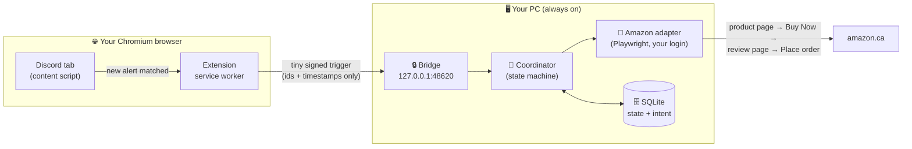
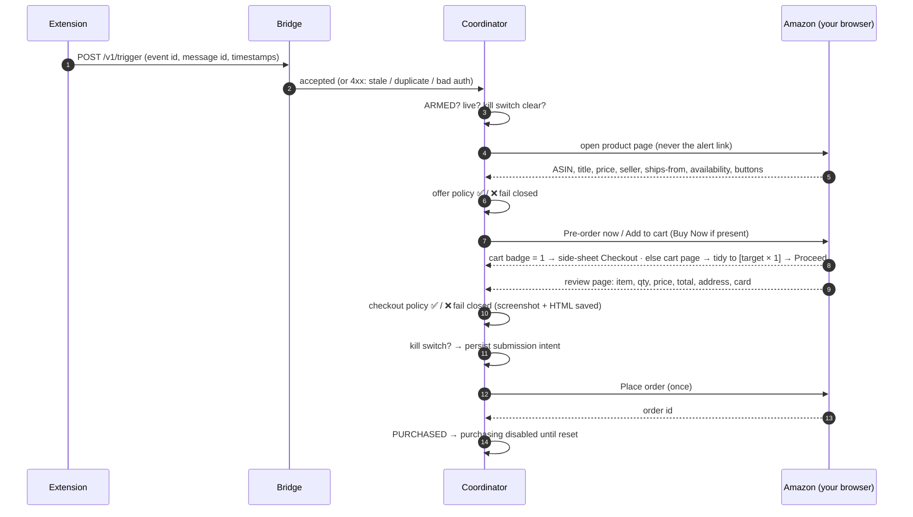
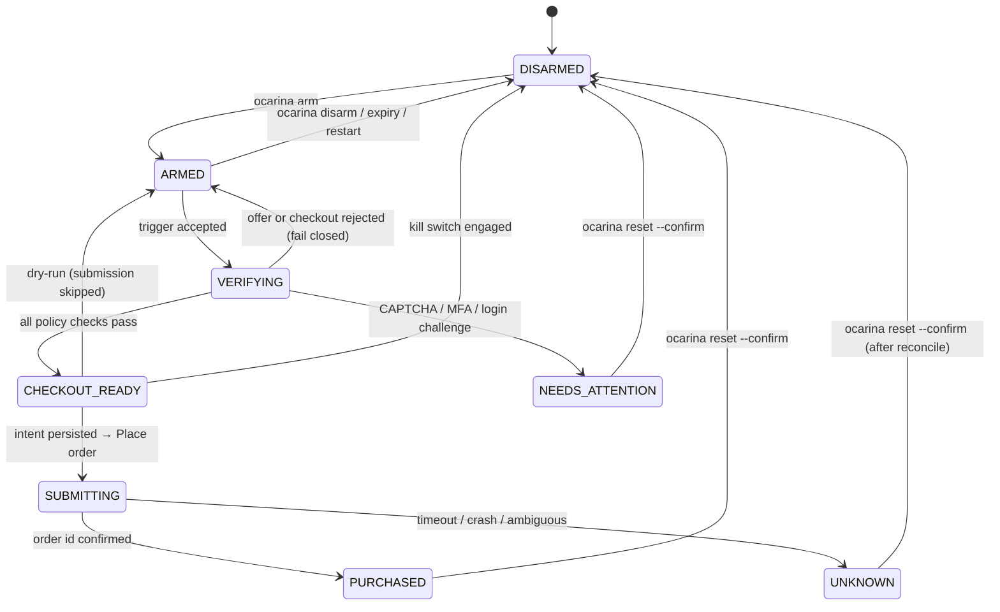

# 🎯 AmoreOcarinaSniper

> A tiny robot with two halves: a **watcher** that lives in your browser and reads one Discord
> channel, and a **buyer** that lives on your PC and places **one** carefully checked order on
> Amazon.ca. It never buys unless *you* have armed it, and it never guesses.

**Target:** Nintendo Switch 2 – The Legend of Zelda – 40th Anniversary Edition
(ASIN [`B0HJ6F8L6V`](https://www.amazon.ca/dp/B0HJ6F8L6V)). The $709.99 in the example alert is
reference only; your spending limits live in `config.toml`.

**Status (2026‑09‑25):** ✅ live end‑to‑end. On the first real alert it detected the post in
103 ms, read the Amazon page in 2.4 s and correctly *refused* a pre‑order because pre‑orders
were disabled. Pre‑orders can now be enabled per policy. The final *review → Place order* page
has still not been seen live; see [What is verified](#-what-is-verified-and-what-is-not).

---

## 📚 Table of contents

1. [How it works](#-how-it-works)
2. [Safety rules](#-safety-rules-enforced-in-code)
3. [Quick start](#-quick-start)
4. [Configuration](#️-configuration)
5. [Commands](#-commands)
6. [Extension setup](#-extension-setup)
7. [Recommended bring‑up](#-recommended-bring-up)
8. [Running 24/7 on Windows](#-running-247-on-windows)
9. [Edge cases and how they end](#-edge-cases-and-how-they-end)
10. [The state machine](#-the-state-machine)
11. [Latency](#-latency)
12. [Tests](#-tests)
13. [What is verified and what is not](#-what-is-verified-and-what-is-not)
14. [Known limitations and blockers](#-known-limitations-and-blockers)
15. [Repository layout](#-repository-layout)

---

## 🧠 How it works

Three pieces, one job each:



### 👀 The watcher (browser extension)

- Sits on **one** Discord channel you configure and watches the rendered message list with a
  `MutationObserver`. No Discord API, no bot, no token, no WebSocket sniffing.
- Ignores everything already on screen when it starts (history is never a trigger) and
  anything older than the freshness window (default 90 s).
- Matches the message text **and** embeds for *Nintendo Switch 2 + Legend of Zelda + 40th
  Anniversary + has been found*, tolerant of ™, unicode dashes, full‑width characters and case.
- Optionally requires a specific **sender display name** (e.g. `Lbabinz`).
- Fires **at most one** trigger per message, retries with the *same* event id if the PC is
  briefly unreachable, and sends only ids and timestamps. Never the chat text. Never a link.

### 🔒 The bridge

- Listens only on `127.0.0.1`. Requires the shared pairing secret, checks the extension origin,
  schema, payload size, clock skew and message freshness, and de‑duplicates durably.
- **Has no power.** It cannot arm, disarm, reset or change limits. Those are CLI commands that
  write straight to SQLite.

### 🧭 The buyer (coordinator + Amazon adapter)



Every field is read from what the browser **actually shows** immediately before the click. If
any field is missing or ambiguous, the attempt stops there. If something goes wrong *after*
the click, the state becomes `UNKNOWN` and the robot refuses to ever click again until you
have looked.

### 🔭 The product watcher (optional second trigger)

The Discord alert is written by someone else's bot, so there is always a gap between Amazon
flipping the listing and the alert appearing. With `[watch] enabled = true`, Python also
re-reads the product page itself on a **second tab** of the same signed-in browser, once
every `interval_s` seconds (default 30, the host runs 15, ±20 % jitter). When that page shows
an offer the policy would accept, it hands the coordinator a synthetic trigger (`watch-<ms>`)
and **promotes its own tab to be the main tab**, so the attempt starts from the page that is
already rendered instead of loading it again (≈ 2 s saved; the coordinator still re‑reads and
re‑evaluates the offer from that DOM, and anything older than 10 s is reloaded). Then the
**exact same** verified checkout runs: verify → Pre‑order now → cart → review page → policy →
intent → Place order. Whichever source fires first wins; the other is skipped as *busy* or,
after a purchase, *disabled*.

Gentle by construction: it polls only while `ARMED`, never while an attempt is in flight,
refuses `interval_s < 10`, backs off exponentially on a CAPTCHA/login challenge (mildly — at
most 2× — on a plain timeout, because a slow Amazon during a rush is exactly when polling
matters), waits `retrigger_cooldown_s` after an attempt it started was **refused by policy**
(not after a timeout), and never changes control state. Cost: 2–4 signed‑in page loads a
minute while armed. If Amazon ever answers with a CAPTCHA, the watcher backs off, logs
`watch_challenge` and pushes your phone; solve it by hand in the browser window.

### Rush conditions: what is retried and what is not

Before the submission intent is persisted nothing has been bought, so timing failures there
are retried, bounded: a step that times out (product page not rendering, add‑to‑cart not
registering, cart rows or the review page not appearing — `unknown_page`, or a browser
`TimeoutError`) is retried up to **2** more times within the same trigger, each pass running
the full offer + review‑page policy again. If all passes fail the bot stays **`ARMED`** for the
next trigger (and pushes a heads‑up after 3 such triggers in a row) instead of parking itself
in `NEEDS_ATTENTION`. Real challenges (CAPTCHA, login, MFA, payment verification) are never
retried and still go to `NEEDS_ATTENTION`. **After** the intent is persisted nothing is ever
retried: one click, then `PURCHASED` or `UNKNOWN`.

---

## 🛡️ Safety rules (enforced in code)

| # | Rule | Where |
| --- | --- | --- |
| 1 | Starts **dry‑run** and **DISARMED**. `--live` *and* `ocarina arm` are both required. | `app.py`, `coordinator.py` |
| 2 | Any restart → **DISARMED**. You must arm again on purpose. | `store.py` |
| 3 | Trigger endpoint cannot arm, disarm, reset or change policy. | `bridge.py` |
| 4 | Missing / unreadable / ambiguous field → **no purchase**. | `policy.py` |
| 5 | Submission intent is written to SQLite **before** the click; ambiguity → `UNKNOWN`, never auto‑retry. | `coordinator.py` |
| 6 | After a confirmed purchase: purchasing **disabled** until `ocarina reset --confirm`. | `store.py` |
| 7 | Quantity 1, your address, your card, allowed seller, price and total caps — all checked on the review page. | `policy.py` |
| 8 | Never opens alert links; always navigates to the configured Amazon URL. | `adapter.py` |
| 9 | Never touches your cart contents; unrelated cart items make the attempt fail closed. | `policy.py` |
| 10 | No CAPTCHA / MFA bypass. Challenges pause the system for a human. | `adapter.py` |
| 11 | No card numbers, passwords, cookies or tokens are ever read, stored or logged. | everywhere |
| 12 | Bridge binds `127.0.0.1` only; no wildcard CORS; no exposed debugging ports. | `bridge.py` |

---

## 🚀 Quick start

> Windows 10/11 (Linux/macOS work too) · Python 3.12+ · a Chromium browser (Chrome, Edge,
> Brave, Comet…) for Discord.

```powershell
git clone https://github.com/christya95/AmoreOcarinaSniper.git
cd AmoreOcarinaSniper
python -m venv .venv
.\.venv\Scripts\Activate.ps1
python -m pip install -e ".[dev]"
python -m playwright install chromium
copy config.example.toml config.toml
```

Then the five‑minute bring‑up:

| Step | Command / action | What it does |
| --- | --- | --- |
| 1️⃣ | edit `config.toml` | Set your price caps, address fragment, card label ([see below](#️-configuration)). |
| 2️⃣ | `ocarina pair` | Creates the secret the extension and Python share. Prints the values to paste. |
| 3️⃣ | `ocarina setup` | Opens the robot's own browser. **You** sign in to Amazon.ca (MFA included). |
| 4️⃣ | `ocarina doctor --browser` | Health check: config, secret, login, product page parse. |
| 5️⃣ | load the extension | `chrome://extensions` → Developer mode → Load unpacked → `extension/`. Fill in Options. |
| 6️⃣ | `ocarina run` | Start the runner in **practice mode**. Leave this window open. |
| 7️⃣ | `ocarina arm --minutes 60` · `ocarina trigger` | Fake an alert and watch it walk the flow (it stops before buying). |
| 8️⃣ | `ocarina run --live` · `ocarina arm` | Real mode, when you are ready. |

🛑 **Emergency stop at any time:** `ocarina kill` (or `ocarina disarm`).

---

## ⚙️ Configuration

`config.toml` is git‑ignored and yours alone. The `[policy]` block ships with `max_item_price =
"0.00"` and empty address/payment fragments on purpose: **`ocarina arm` refuses until you fill
them in deliberately.**

| Key | Meaning |
| --- | --- |
| `policy.max_item_price` | CAD, decimal **string** (`"709.99"`). Item price on product *and* review page must be ≤ this. |
| `policy.max_total` | CAD. Order total incl. tax, shipping, fees on the review page must be ≤ this. |
| `policy.allowed_sellers` | e.g. `["amazon.ca"]`. Third‑party sellers are rejected unless listed. |
| `policy.fulfillment` | `"amazon"` (Ships from Amazon) or `"any"`. If Amazon renders no *Ships from* row, Amazon‑as‑seller is accepted; other sellers fail closed. |
| `policy.allow_preorder` | Default `false`. Accept listings that say *"This item will be released on … Pre‑order now."* Every other check still applies. |
| `policy.approved_address_contains` | Short fragment that must appear in the shipping address (e.g. `1447 Sycamore`). |
| `policy.approved_payment_contains` | Fragment that must appear in the payment block (e.g. `ending in 4105`). When it ends in four digits, `Visa •••• 4105` / `****4105` renderings are accepted too; any other digits are not. |
| `policy.default_arm_minutes` / `max_arm_minutes` | Armed‑session bounds (default 120 / 720). |
| `target.discord_channel_id` | Optional pin: bridge rejects triggers from any other channel. |
| `bridge.allowed_extension_origin` | Optional pin: `chrome-extension://<your extension id>`. |
| `bridge.message_freshness_s` | Rendered Discord timestamp must be at most this old (default 90). |
| `checkout.strategy` | `"buy_now"` (default) or `"cart"`. |
| `watch.enabled` | Default `false`. Poll the product page yourself as a second trigger source (see *The product watcher*). |
| `watch.interval_s` | Seconds between polls while armed (default 30, ±20 % jitter; values below 10 are refused). |
| `watch.retrigger_cooldown_s` | After a watcher-started attempt that policy **refused**, do not re-attempt the **same offer** (price/seller/availability unchanged) for this long (default 120). A changed offer triggers at once; a transient timeout starts no cooldown. |
| `notify.ntfy_topic` | Empty = off. A long random topic name you also subscribe to in the ntfy phone app. Pushes on ORDER PLACED, stock‑seen‑but‑REFUSED, NEEDS_ATTENTION/UNKNOWN, first watch‑tab challenge, runner start. |
| `telemetry.verbose` | Mirror every telemetry event into the console log. Diagnostic only. |

💡 Keep the address and card fragments **short**. Amazon may render "Sycamore Garden" as
"Sycamore Gdn" or split a postal code; matching is case‑ and punctuation‑insensitive substring.

---

## 🧰 Commands

```powershell
ocarina pair                  # 🔑 generate the pairing secret and print extension values
ocarina setup                 # 🔐 open the dedicated browser; sign in to Amazon.ca yourself
ocarina doctor                # 🩺 readiness: config, secret, profile, policy, selector table
ocarina doctor --browser      # 🩺 + open the product page, print parsed offer + verdict
ocarina doctor --browser --checkout-probe   # 🩺 + dry‑run into the review page, print every field (nothing submitted)
ocarina doctor --browser --checkout-probe --probe-asin B0XXXXXXXX
                              # 🎭 rehearsal: same path against a cheap in‑stock stand‑in, cart strategy
                              #    forced, per‑step timings, redacted page dumps in runtime/artifacts/probe-*/.
                              #    Policy is reported (it refuses the stand‑in), never bypassed; nothing is
                              #    submitted. Stop the runner first (one browser per profile); empty the cart after.
ocarina run                   # 🏃 always‑on runner, DRY‑RUN (never clicks Place order)
ocarina run --live            # 🏃 real mode: submits when armed and all checks pass
ocarina arm --minutes 120     # 🟢 arm for a bounded time (refused if policy is incomplete)
ocarina disarm                # 🔴 disarm
ocarina kill                  # 🛑 kill switch + disarm; checked right before the final click
ocarina status --transitions  # 📊 state, last attempt, event log, state history
ocarina trigger               # 🧪 synthetic alert through the real bridge
ocarina trigger --stale-seconds 600         # 🧪 demonstrates freshness rejection (HTTP 410)
ocarina reset --confirm       # ♻️ leave PURCHASED / UNKNOWN / NEEDS_ATTENTION, re‑enable
ocarina reconcile             # 🔎 read‑only look at order history to resolve UNKNOWN
ocarina notify-test           # 📱 send a test push to your phone (ntfy)
```

`ocarina` is a console script; `python -m amore_ocarina_sniper …` is equivalent. Use `--config`
or `OCARINA_CONFIG` for a different config file. The runner mirrors its console log to
`runtime/logs/runner.log`.

---

## 🧩 Extension setup

1. `ocarina pair` → note **Bridge port**, **Pairing secret**, **Target id**.
2. `chrome://extensions` → **Developer mode** on → **Load unpacked** → pick the `extension/` folder.
3. Open the extension's **Options** and fill in:
   - **Guild id** and **Channel id** from the Discord URL `discord.com/channels/<guild>/<channel>`
   - **Bridge port**, **Pairing secret**, **Target id** from step 1
   - **Sender display name** (optional), e.g. `Lbabinz`
   - **Sender user id**: leave **empty** for apps with a default avatar (see caveat below)
4. Save → **Test bridge** (the runner must be running).
5. Optional hardening: put the extension id into `bridge.allowed_extension_origin` in
   `config.toml` and restart the runner.
6. Open the Discord channel in a tab and **leave it there**. If the tab was already open when
   you loaded the extension, reload it once (content scripts only inject into fresh loads).

### 🟢 The popup

| Row | Meaning |
| --- | --- |
| Bridge | `connected` = the extension can reach Python. |
| Python state | e.g. `ARMED · LIVE · armed` or `DISARMED · dry‑run`. |
| This tab / Channel / Monitoring | Whether *this* tab is Discord, on the right channel, and being watched. |
| Last match | The last alert forwarded and how delivery went. |
| Last skip | The last reason a candidate was dropped (stale, no timestamp, sender not identifiable…). |

The extension sends only `event_id, message_id, channel_id, guild_id, matched_target,
message_ts_ms, sent_at_ms, detected_at_offset_ms, attempt, source`. No chat text.

### 🔍 Discord DOM check

Live‑verified 2026‑09‑24 against a real alert in the target channel:
`ol[data-list-id="chat-messages"]`, `li#chat-messages-<channel>-<message>`,
`#message-content-<id>`, `#message-accessories-<id>`, `time[datetime]`, embed
title/description, and `span#message-username-<id>` → `span.username_*[data-text]` + a
`span.botTag*` badge reading `APP`. Selectors live in `extension/content/selectors.js`. If
Discord changes its DOM, re‑check in DevTools on the channel:

```js
document.querySelector('ol[data-list-id="chat-messages"] li[id^="chat-messages-"]')?.id
document.querySelector('li[id^="chat-messages-"] time[datetime]')?.getAttribute('datetime')
```

⚠️ **Sender user id caveat.** The id is read from the avatar image URL (`/avatars/<id>/…`).
Authors using Discord's **default** avatar render `/assets/<hash>.png` and expose **no user id
anywhere** in the message DOM; the alert app in the target channel is one of them. With a user
id configured, every one of their messages fails closed. Leave it empty and rely on the display
name (the channel is read‑only, so only moderators and their apps can post). *Last skip* in the
popup makes such drops visible.

---

## 🧭 Recommended bring‑up

1. `ocarina pair`, then `ocarina setup` — sign in, confirm a saved address and card exist.
2. `ocarina doctor --browser` — expect `signed_in=True`, `challenge=None`, title parsed.
3. Practice mode: `ocarina run` in one window; `ocarina arm --minutes 60` and `ocarina trigger`
   in another. Read `ocarina status --transitions`: you should see
   `ARMED → VERIFYING → ARMED` with a reason such as *not in stock*.
4. Load the extension, confirm the popup is green on the Discord tab.
5. The **first time the item is actually purchasable**: `ocarina doctor --browser
   --checkout-probe` prints every review‑page field it reads. Check each one. (If the window is
   too short for that, the live runner saves a screenshot and the page HTML on any refusal, so
   a miss is fixable before the next window.)
6. `ocarina run --live`, `ocarina arm --minutes N`.

---

## 🖥️ Running 24/7 on Windows

- 💤 **No sleep:** `powercfg /change standby-timeout-ac 0` and
  `powercfg /change monitor-timeout-ac 0` (or Settings → Power). A sleeping PC watches nothing.
- 🧠 **Memory Saver:** `chrome://settings/performance` → add `discord.com` to *Always keep
  these sites active* (or turn Memory Saver off). Discarded tabs stop detecting.
- 🪟 **Windows to keep open:** the Discord tab, the `ocarina run --live` terminal, and the
  Chromium window it controls. Launch the runner in its own PowerShell window (or a Scheduled
  Task, *Run only when user is logged on*, trigger *At log on*) so it outlives your editor.
- 🔁 **Restarts:** any restart → `DISARMED` (and `UNKNOWN` if it died after intent).
  `ocarina status`, resolve, then `ocarina arm` again.
- 🧩 **Challenges:** CAPTCHA, MFA, expired login, payment verification → `NEEDS_ATTENTION`
  with a screenshot in `runtime/artifacts/`. Solve them **in the same browser profile**
  (RDP/VNC/Tailscale into the host). A *disconnected* RDP session keeps the desktop alive;
  a *locked* console can throttle Chrome timers.
- 🔒 Never expose port 48620 or a browser debugging port beyond loopback.

---

## 🧯 Edge cases and how they end

Everything below is **fail‑closed**: the worst outcome is a *missed* purchase, never a wrong
one. The table says what the robot does and what *you* can do beforehand so the miss does not
happen.

| Situation | What the robot does | What you should do beforehand |
| --- | --- | --- |
| The pre‑order page has no *Buy Now*, only *Pre‑order now* | That button is the add‑to‑cart slot, so the **cart path is the main path**: click → wait for Amazon's confirmation → if the cart badge shows exactly **1** unit and the side sheet offers *Proceed to checkout*, go straight there (cart page skipped) → otherwise open the cart, tidy it, proceed. | Nothing; handled. |
| Other items already in your Amazon cart | On the cart page the robot **unticks** them (Amazon.ca carts have per‑item checkout checkboxes), else moves them to **Save for later**, else deletes them; re‑reads; proceeds only when exactly the target at quantity 1 is selected. Up to 6 passes, bounded by `element_timeout_ms`. The review‑page check (1 line item, qty 1) still runs afterwards. | Still keep the cart **empty**: it skips the cart page and saves ~1–2 s. |
| The console is already in the cart (leftover from a refused attempt) | Quantity becomes 2; the robot steps it back to **1**, one decrement per pass with a re‑read in between, because on the live stepper the same button turns into **Delete** at quantity 1. | Empty the cart after any refused attempt; the runner log says so (`abandon: the cart path was used…`). |
| Add‑to‑cart clicked but the cart does not contain the console | `target item not in cart after add to cart` → refused before checkout, screenshot + HTML saved. | Send the artifacts; no auto‑retry by design. |
| Cart rows cannot be read at all (selector drift) | Logged; the robot proceeds and lets the review‑page policy decide (2 items / qty 2 → refused). | Send the artifacts. |
| Review page shows a different address or card | Refused (`shipping address does not match` / `payment method does not match`). The robot never changes selections. | In Amazon → *Your Addresses* set **1447 Sycamore** as default; *Your Payments → Wallet* set the **Visa ending 4105** as default. Buy Now uses the defaults. |
| Card rendered as `Visa •••• 4105` instead of `ending in 4105` | Accepted: a fragment ending in four digits also matches masked renderings of those exact digits. | Nothing. |
| Amazon asks to re‑enter the security code (CVV) | A *visible* card input on the review page is refused **before** the click (`payment requires manual input`) with screenshot + HTML, instead of ending in `UNKNOWN` after it. The robot never types card data. | Use the card on Amazon once shortly before the drop (any small order) so it is “recently verified”. |
| Amazon asks for your password at checkout | `login_required` → `NEEDS_ATTENTION`, push to your phone. | Keep the browser window reachable (RDP/Tailscale) and sign in by hand; then `ocarina reset --confirm` and re‑arm. |
| CAPTCHA on the watch tab | Watcher backs off, one push. Discord path unaffected. | Solve it in the browser window. |
| You are also watching with a phone stock app (HotStock etc.) | The robot cannot see your manual orders. Two orders are possible if you both buy in the same minute. | **Rule: robot first.** When your phone alerts, wait for the push: *ORDER PLACED* → do nothing; *REFUSED — buy manually* → go; no push within ~10 s → check `ocarina status`, then go manual. If you do buy manually, run `ocarina kill` immediately. |
| Pre‑order button reads “Pre‑order now” | Same `#buy-now-button` / `#add-to-cart-button` ids; handled. Price/seller/condition still verified. | Keep `policy.allow_preorder = true`. |
| Product page shows a variant/edition picker | Refused (`variant selector present`). | Nothing; the alert‑matched ASIN is a single edition. |
| Amazon is slow or the add‑to‑cart fails during the rush | Step times out → retried up to 2× within the same trigger (the retry reuses the product page it just reloaded); if still failing, back to `ARMED` (`transient failure before submission`) with screenshot + HTML of the page that failed; the watcher polls again on its next tick with no cooldown. Pushes: *Stock seen — bot retrying* (informational, first retry) and a heads‑up after 3 such triggers in a row. | Be at the screen; do **not** buy on the *retrying* push. Go manual only on *REFUSED — buy manually*. |
| Amazon's own error page (“Sorry! Something went wrong”, CloudFront *request could not be satisfied*) | Classified `server_error`: treated like a timeout (retried, stays `ARMED`, watcher backs off mildly). Only *Access Denied* / *automated access* pages stop the bot. | Nothing. |
| Review page shows only the greyed‑out *Place your order* buttons (Amazon still updating a selection) or an address/payment interstitial | Waits up to `element_timeout_ms` for an **enabled, visible** button, then treats it as transient and retries from the product page instead of refusing and pausing the watcher. | Nothing. |
| A third‑party seller lists first at an inflated price | Refused by policy; the watcher's `retrigger_cooldown_s` applies **only to that offer**. When the page changes (Amazon's offer appears, price changes) the next poll triggers immediately. | Nothing. |
| Arm window about to lapse / lapsed | Push *arm window ends in 30 minutes*, then *DISARMED: armed session expired*. The window is never extended automatically. | `ocarina arm --minutes N` (≤ `policy.max_arm_minutes`). Raise `max_arm_minutes` in `config.toml` if 12 h is too short for your schedule. |
| Review‑page selectors drift (Amazon layout change) | Unreadable field → refused with screenshot + all‑frame HTML in `runtime/artifacts/`; the bot stays armed. | Send the artifacts here; fixing a selector takes minutes. Re‑run the rehearsal (`--probe-asin`). |

---

## 🔁 The state machine



`PURCHASED`, `UNKNOWN` and `NEEDS_ATTENTION` are **sticky**: purchasing stays disabled until an
explicit `ocarina reset --confirm`. Transitions are compare‑and‑set in SQLite and guarded by a
process lock, so two events, two processes, or a restart cannot race each other into a second
order. This makes "we clicked twice" impossible; it does not make browser automation
exactly‑once, which is why `UNKNOWN` exists.

---

## ⏱️ Latency

Measured points (in `runtime/logs/telemetry.jsonl`): rendered Discord timestamp → extension
detection → bridge receipt → offer verified → checkout prepared → intent persisted → submitted
→ confirmed. In‑process spans use `perf_counter_ns`; cross‑process figures are wall‑clock deltas
and reported separately.

**Real numbers from the first live alert (2026‑09‑25 03:52):**

| Hop | Time |
| --- | --- |
| Discord message timestamp → extension detected | **103 ms** |
| extension → bridge received | **7 ms** |
| bridge → product page read and policy decided | **2.35 s** |
| **Total to decision** | **≈ 2.5 s** |

The pre‑order window that night lasted **under three minutes** (a human attempt at +3 min found
it gone). No end‑to‑end purchase latency has been measured yet; none is promised.

**Where the time goes and what can be done about it.** Our side (detection, bridge, DOM
reads, clicks) is a few hundred milliseconds in total; the rest is Amazon serving three pages.
`checkout.block_heavy_assets` was benchmarked (2026‑09‑25, 16 alternating headless loads):
1.3 s per product page either way, because verification already stops at `DOMContentLoaded`.
It stays off. The lever that does matter is *starting earlier*: the optional
[product watcher](#-the-product-watcher-optional-second-trigger) removes the dependency on
someone else's alert bot for the first signal.

---

## 🧪 Tests

```powershell
python -m pytest -q          # 238 tests, ~95 s (headless Chromium for fixture‑driven tests)
ruff check src tests
```

All tests run against **local fixtures**; no request ever reaches Discord or Amazon and no
order can be placed. Coverage highlights:

- 🔤 **Matching:** text/embeds, Unicode/full‑width/™ variants, unrelated products, delayed
  embeds; JS/Python parity vectors.
- 👀 **Content script:** baseline history, duplicate mutations, stale messages, missing
  timestamps, virtualized re‑mounts, list replacement, channel navigation, DOM channel mismatch,
  sender gates (name with `APP` badge, default‑avatar user id), pause, extension reload, status
  pull after worker restart.
- 🔁 **Service worker:** auth header + schema, durable dedupe, terminal 4xx, bounded retries
  with the same event id, worker restart, gating.
- 🔒 **Bridge:** auth, origin/host, size, JSON, stale/skew, target/channel pin, duplicate retries.
- 🛒 **Amazon adapter:** in‑stock / unavailable / **pre‑order** / third‑party / variant / USD /
  wrong‑ASIN offers; CAPTCHA, sign‑in and signed‑out challenges; review‑page parsing; two line
  items, wrong address, wrong payment, unreadable total, over total, third‑party seller,
  quantity 2; dry‑run refusal; live confirm, ambiguous, payment challenge.
- 🧭 **Coordinator:** dry‑run never submits; purchase disables until reset; crash before/after
  intent; ambiguous submission → `UNKNOWN` with no retry; kill switch; disarm mid‑attempt;
  concurrency; evidence captured before leaving a rejected review page.
- 🗄️ **Store/lock:** CAS transitions, restart recovery, two‑process lock.

---

## ✅ What is verified and what is not

| Area | Status | Notes |
| --- | --- | --- |
| Discord DOM (list, ids, timestamp, embeds, username + `APP` badge) | ✅ live 2026‑09‑24 | Real alert in the target channel. Sender **user id absent** for the alert app (default avatar). |
| Extension → bridge → runner, armed, live | ✅ live 2026‑09‑25 03:52 | Real alert; 103 ms + 7 ms + 2.35 s. |
| Product page: `input#ASIN`, `#productTitle`, `#availability`, price, `#buy-now-button`, `#add-to-cart-button`, `#quantity`, `#twister`, `#nav-link-accountList` | ✅ live | Signed‑out (2026‑09‑24) and signed‑in armed run (2026‑09‑25). |
| Seller text `Amazon.ca` via `#merchantInfoFeature_feature_div` | ✅ live 2026‑09‑25 | |
| *Ships from* row on an Amazon‑sold pre‑order | ✅ observed **absent** | Fulfillment is now inferred from Amazon‑as‑seller in that case. |
| Pre‑order availability text | ✅ live 2026‑09‑25 | *"This item will be released on October 29, 2026. Pre‑order now."* |
| Checkout review page (`/checkout/p/<id>/spc`): ASIN as **text** in `[data-testid^='Item_asin_']`, `.lineitem-container` (count), `.lineitem-title-text`, `.lineitem-price-text`, quantity in the atomic stepper `fieldset[name='checkout-quantity-stepper'] [data-a-selector='inner-value']`, seller `.lineitem-seller-section` (*Sold by …*), *Ships from …* line, `#deliver-to-address-text`, `#selected-payment-methods-list-container` (*Paying with Visa 4105*), order total `#subtotals-marketplace-table .a-text-bold [data-shimmer-target='ordertotals-amount']`, `input[name='placeYourOrder1']` top + bottom **plus four disabled blocker copies** | ✅ live 2026‑09‑25 21:19 | Operator's signed‑in review page (redacted HTML). **Six of the previously assumed fields (ASIN, quantity, total, seller, address, payment) would have read empty** and refused the order; all fixed and the fixture `checkout.html` rebuilt to mirror the live markup. No condition row (inherited from the product page). No CVV prompt for the saved Visa. Place‑order candidates now carry `:not([disabled])`. |
| Turbo‑checkout iframe, confirmation markers, order‑id pattern | ⚠️ assumed | Iframe is irrelevant on the cart path. Confirmation ambiguity ends in `UNKNOWN` (stop + push), never a second click. |
| Cart page: `#sc-active-cart[data-cart-total-item-count]`, `ul[data-name="Active Items"]`, rows `.sc-list-item[data-asin][data-quantity][data-isselected]`, checkout checkbox `.sc-list-item-checkbox input`, gift checkbox (avoided), atomic stepper `fieldset[data-action=a-stepper][data-steppervalue]` + decrement `button[data-action=a-stepper-decrement]` (labelled **Delete** at qty 1, *Decrease quantity by one* above), `input[data-action=save-for-later]`, `input[data-action=delete-active]`, `#nav-cart-count`, `#sc-buy-box[data-quantity]` | ✅ live 2026‑09‑25 21:04 | Operator's signed‑in cart with one item (outerHTML of `#sc-active-cart`). Fixture `cart.html` mirrors it. |
| Cart *Proceed to checkout*: `input[name='proceedToRetailCheckout'][data-feature-id='proceed-to-checkout-action'][aria-labelledby='sc-buy-box-ptc-button-announce']` | ✅ live 2026‑09‑25 21:16 | Operator paste of the button element. |
| Add‑to‑cart confirmation: button class `attach-dss-atc` adds via AJAX and opens `#attach-desktop-sideSheet[aria-modal]` with a **warranty upsell** (`#attach-warranty-pane`, *Add coverage* / *No thanks*) behind `#attach-popover-lgtbox`; no *Proceed to checkout* offered there | ✅ rehearsed 2026‑09‑25 21:47 in the bot's own profile | Detected as *visible surface* in 0.30 s. Before the fix none of the assumed ids existed and the bot waited out the full element timeout (review page at 11.4 s → now 3.0 s). The cart page follows; the upsell is never clicked. |
| Side‑sheet *Proceed to checkout* (`#attach-sidesheet-checkout-button`) fast path | ⚠️ assumed / not offered | Kept as an opportunistic candidate; the verified path is via the cart page. |
| Review‑page CVV / card‑input prompt (`payment_input`) | ⚠️ assumed (observed **absent** 2026‑09‑25 for the saved Visa) | Visibility‑checked only, so a wrong guess can never block a normal checkout; it can only miss a prompt (which then ends in `UNKNOWN` as before). |
| Order history for `reconcile`: `/gp/css/order-history` (redirects to *Your Orders*), order ids `\d{3}-\d{7}-\d{7}` in *Order #* cards | ✅ live 2026‑09‑25 21:53 | Operator's signed‑in page: 10 order cards, 11 ids, all matching. `reconcile` reads page text only — no selectors. |
| MFA selectors | ⚠️ assumed | Only ever pause the bot; never bypassed. |
| Does the pre‑order page show *Buy Now* at all? | ❓ operator says **no** (2026‑09‑25) | Only *Pre‑order now* (add‑to‑cart slot). The adapter takes the cart path automatically whenever Buy Now is absent; the cart is tidied to the single target unit first. |

`ocarina doctor` prints the live selector table with each field's status.

---

## 🚧 Known limitations and blockers

- 🔐 Needs an Amazon.ca account signed in inside `profiles/amazon` with a saved address and
  payment method. The tool never types credentials or card data and stores none.
- 🪟 The Discord tab must stay loaded on the exact channel. Discord UI changes can break
  selectors silently; the popup shows *list not found* / *Last skip* when that happens.
- 🤝 The source Discord server prohibits bots except those run by moderators. This design uses
  no bot and no Discord API, but **moderator acceptance of local automated monitoring is
  unresolved**. Nothing here conceals the extension's existence or behaviour; ask before use.
- 🤖 Amazon may challenge automation‑flagged sessions (headless especially). Challenges pause
  the system; they are never bypassed.
- 🧾 Review‑page selectors were verified against one live review page (2026‑09‑25, third‑party
  item). Amazon A/B‑tests checkout layouts per session; legacy candidates remain as fallbacks
  and any unreadable field still fails closed with a screenshot + HTML dump.
- ⏳ A pre‑order/restock window can close in minutes. The robot decides in ~2.5 s but cannot
  beat Amazon's own queueing or a sold‑out‑in‑seconds drop.

---

## 🗂️ Repository layout

```
AGENTS.md                         working notes: hard rules, milestones, task board, decision log
extension/                        unpacked MV3 extension
  manifest.json                   permissions: storage, alarms; hosts: discord.com, 127.0.0.1
  shared/matcher.js               text normalisation + match rules (parity with Python)
  content/selectors.js            Discord DOM selectors (verification status in header)
  content/observer.js             MutationObserver, baseline, freshness, sender gate, candidates
  background.js                   dedupe, retries, bridge delivery, popup state
  popup.html/js, options.html/js  status UI and configuration
src/amore_ocarina_sniper/
  config.py  policy.py  models.py store.py  lock.py  killswitch.py
  telemetry.py  bridge.py  coordinator.py  app.py  cli.py
  watch.py                        optional product-page poller (second trigger source)
  notify.py                       optional ntfy push to the operator's phone (off critical path)
  amazon/selectors.py             Amazon selectors with VERIFIED / ASSUMED status
  amazon/extract.py               one‑round‑trip DOM extractor + fail‑closed parsers
  amazon/adapter.py               Playwright flow: product → checkout → confirm; evidence capture
tests/                            pytest suite; fixtures/discord/channel.html, fixtures/amazon/*.html
config.example.toml               secret‑free example configuration
```

🚫 Never commit `config.toml`, `secrets/`, `profiles/`, `runtime/`, or anything under
`artifacts/`. They are git‑ignored; keep them that way.

---

<p align="center">Built for exactly one order. Fails closed. Asks a human when unsure. 🎮</p>
